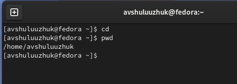
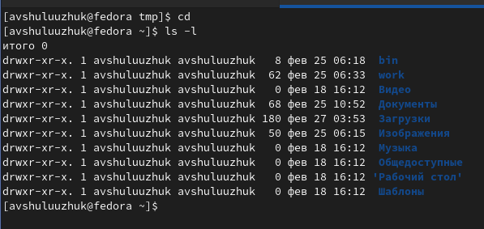
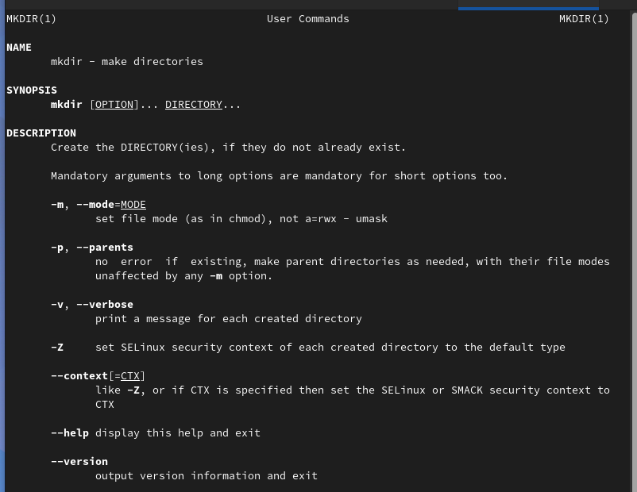
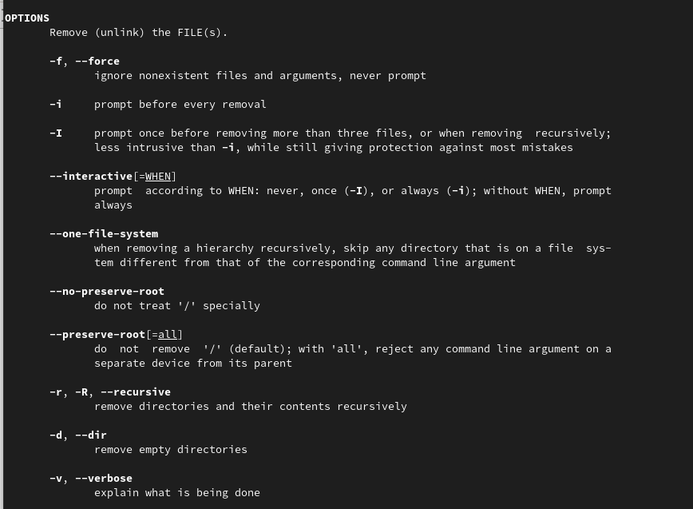

---
## Front matter
title: "Лабораторная работа № 4"
subtitle: Операционные системы"
author: "Шулуужук Айраана Вячеславовна"

## Generic otions
lang: ru-RU
toc-title: "Содержание"

## Bibliography
bibliography: bib/cite.bib
csl: pandoc/csl/gost-r-7-0-5-2008-numeric.csl

## Pdf output format
toc: true # Table of contents
toc-depth: 2
lof: true # List of figures
lot: true # List of tables
fontsize: 12pt
linestretch: 1.5
papersize: a4
documentclass: scrreprt
## I18n polyglossia
polyglossia-lang:
  name: russian
  options:
	- spelling=modern
	- babelshorthands=true
polyglossia-otherlangs:
  name: english
## I18n babel
babel-lang: russian
babel-otherlangs: english
## Fonts
mainfont: PT Serif
romanfont: PT Serif
sansfont: PT Sans
monofont: PT Mono
mainfontoptions: Ligatures=TeX
romanfontoptions: Ligatures=TeX
sansfontoptions: Ligatures=TeX,Scale=MatchLowercase
monofontoptions: Scale=MatchLowercase,Scale=0.9
## Biblatex
biblatex: true
biblio-style: "gost-numeric"
biblatexoptions:
  - parentracker=true
  - backend=biber
  - hyperref=auto
  - language=auto
  - autolang=other*
  - citestyle=gost-numeric
## Pandoc-crossref LaTeX customization
figureTitle: "Рис."
tableTitle: "Таблица"
listingTitle: "Листинг"
lofTitle: "Список иллюстраций"
lotTitle: "Список таблиц"
lolTitle: "Листинги"
## Misc options
indent: true
header-includes:
  - \usepackage{indentfirst}
  - \usepackage{float} # keep figures where there are in the text
  - \floatplacement{figure}{H} # keep figures where there are in the text
---

# Цель работы

Приобретение практических навыков взаимодействия пользователя с системой посредством командной строки.

# Задание

1. Определите полное имя вашего домашнего каталога. Далее относительно этого каталога будут выполняться последующие упражнения.

2. Выполните следующие действия:

2.1. Перейдите в каталог /tmp.

2.2. Выведите на экран содержимое каталога /tmp. Для этого используйте команду ls с различными опциями. Поясните разницу в выводимой на экран информации.

2.3. Определите, есть ли в каталоге /var/spool подкаталог с именем cron?

2.4. Перейдите в Ваш домашний каталог и выведите на экран его содержимое. Определите, кто является владельцем файлов и подкаталогов?

3. Выполните следующие действия:

3.1. В домашнем каталоге создайте новый каталог с именем newdir.

3.2. В каталоге ~/newdir создайте новый каталог с именем morefun.

3.3. В домашнем каталоге создайте одной командой три новых каталога с именами letters, memos, misk. Затем удалите эти каталоги одной командой.

3.4. Попробуйте удалить ранее созданный каталог ~/newdir командой rm. Проверьте, был ли каталог удалён.

3.5. Удалите каталог ~/newdir/morefun из домашнего каталога. Проверьте, был ли каталог удалён.

4. С помощью команды man определите, какую опцию команды ls нужно использовать для просмотра содержимое не только указанного каталога, но и подкаталогов, входящих в него.

5. С помощью команды man определите набор опций команды ls, позволяющий отсортировать по времени последнего изменения выводимый список содержимого каталога с развёрнутым описанием файлов.

6. Используйте команду man для просмотра описания следующих команд: cd, pwd, mkdir, rmdir, rm. Поясните основные опции этих команд.

7. Используя информацию, полученную при помощи команды history, выполните модификацию и исполнение нескольких команд из буфера команд

# Выполнение лабораторной работы

1. Определим полное имя домашнего каталога. Используем команду pwd (рис. @fig:001)

{#fig:001 width=70%}

2. Перейдем в каталог /tmp

Выводим на экран сожержимое каталога tmp, используя команду ls с различными опциями.

Команда ls используется для просмотра содержимого каталога (рис. @fig:002)

{#fig:002 width=70%}

Команда ls -a для просмотра имен скрытых файлов (рис. @fig:003)

{#fig:003 width=70%}

Команда ls -l используется для просмотра полной информации о файлах и каталогах (рис. @fig:004)

{#fig:004 width=70%}

Команда ls -F для получения информации о типах файлов (каталог, исполняемый файл, ссылка) (рис. @fig:005)

{#fig:005 width=70%}

Определим, есть ли в каталоге /var/spool подкаталог с именем cron

Для этого проводим команды ls и ls -a  для просмотра имен скрытых файлов. В результате мы находим, что нет файла с именем cron (рис. @fig:006). 

{#fig:006 width=70%}

Переходим в домашний каталог. Выводим на экран его содержимое и определяем кто является владельцем файлов и каталогов. Используем команду ls -l (рис. @fig:007) 

{#fig:007 width=70%}

3. В домашнем каталоге создадим новый каталог с именм newdir. Используем команду mkdir newdir и проверяем наличие созданного каталога (рис. @fig:008)

{#fig:008 width=70%}

В каталоге /newdir создадим новый каталог с именем morefun. Для этого в домашнем каталоге используем команду mkdir newdir/morefun и проверяем испольнение команды  (рис. @fig:009).

{#fig:009 width=70%}

Создадим три новых каталога с именами letters, memos, misk. Используем команду mkdir letters memos misk.
Проверяем их наличие (рис. @fig:010)

{#fig:010 width=70%}

Затем удаляем эти каталоги одной командой rmdir letters memos misk и проверим удалились ли они (рис. @fig:011)

{#fig:011 width=70%}

Попробуем удалить каталог newdir командой rm без опций. В результате выдает, что мы не можем его удалить (рис. @fig:012)

{#fig:012 width=70%}

Удаляем каталог /newdir/morefun командой rm с опцией -r. Проверяем удаление каталога (рис. @fig:013)

{#fig:013 width=70%}

4. С помощью команды man ls определяем, что для просмотра содержимого каталога и подкаталогов, входящих в него, нужно использовать опцию -R (рис. @fig:014)

{#fig:014 width=70%}

5. С помощью команды man ls опредеяем набор опций команды, позволяющий отсортировать по времени последнего изменения  список содержимого каталога. Это опции: -с -lt (рис. @fig:015)

{#fig:015 width=70%}

6. Используем команду man для просмотра описания команд: cd, pwd, mkdir, rmdir, rm 

Команда cd испоьзуется для перемещения по файловой системе (рис. @fig:016)

{#fig:016 width=70%}

Для определения абсолютного пути к текущему каталогу используется команда pwd  (рис. @fig:017)

{#fig:017 width=70%}

Команда mkdir используется для создания каталогов (рис. @fig:018)

{#fig:018 width=70%}

Команда rmdir используется для удаления пустых каталогов (рис. @fig:019)

{#fig:019 width=70%}

Команда rm используется для удаления файлов и каталогов (рис. @fig:020)

{#fig:020 width=70%}

Используя информацию, полученную при помощи команды history, выполняем модификацию команд mcdir, rmdir (рис. @fig:021)

{#fig:021 width=70%}

# Контрольные вопросы

1. Что такое командная строка? 

Терминал Linux предоставляет интерфейс, в котором можно вводить команды и видеть результат, напечатанный в виде текста. Можно использовать терминал для выполнения таких задач, как перемещение файлов или навигация по каталогу, без использования графического интерфейса.

2. При помощи какой команды можно определить абсолютный путь текущего каталога? Приведите пример.

При помощи команды pwd.

3. При помощи какой команды и каких опций можно определить только тип файлов и их имена в текущем каталоге? Приведите примеры.

ls -F

4. Каким образом отобразить информацию о скрытых файлах? Приведите примеры.

Для того, чтобы отобразить имена скрытых файлов, необходимо использовать команду ls с опцией a.

5. При помощи каких команд можно удалить файл и каталог? Можно ли это сделать одной и той же командой? Приведите примеры. 

rmdir и rm.

6. Каким образом можно вывести информацию о последних выполненных пользователем командах? работы?

7. Как воспользоваться историей команд для их модифицированного выполнения?
Приведите примеры.

С помощью команды history.

8. Приведите примеры запуска нескольких команд в одной строке.

9.  Дайте определение и приведите примера символов экранирования.
 
Экранирование символов — замена в тексте управляющих символов на соответствующие
текстовые подстановки.

10. Охарактеризуйте вывод информации на экран после выполнения команды
ls с опцией l.

Чтобы вывести на экран подробную информацию о файлах и каталогах, необходимо использовать опцию l. При этом о каждом файле и каталоге будет выведена следующая информация: тип файла, право доступа,
число ссылок, владелец, размер, дата последней ревизии, имя файла или каталога.

11. Что такое относительный путь к файлу? Приведите примеры использования
относительного и абсолютного пути при выполнении какой-либо команды.

Относительный путь представляет собой путь по отношению к текущему
рабочему каталогу пользователя или активных приложений.

12. Как получить информацию об интересующей вас команде? 

При помощи команды man.

13. Какая клавиша или комбинация клавиш служит для автоматического дополнения вводимых команд?

Tab

# Выводы

В ходе выполнения лабораторной работы были приобретены практические навыки взаимодействия пользователя с системой посредством командной строки

