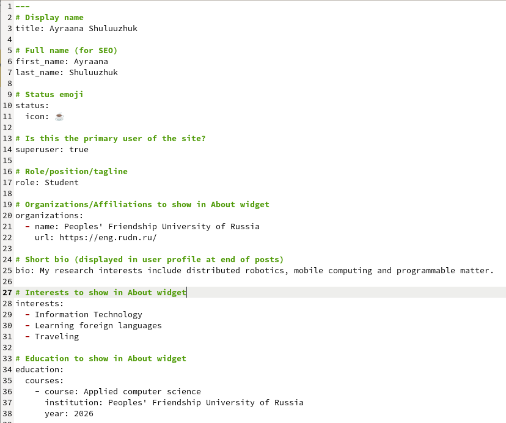
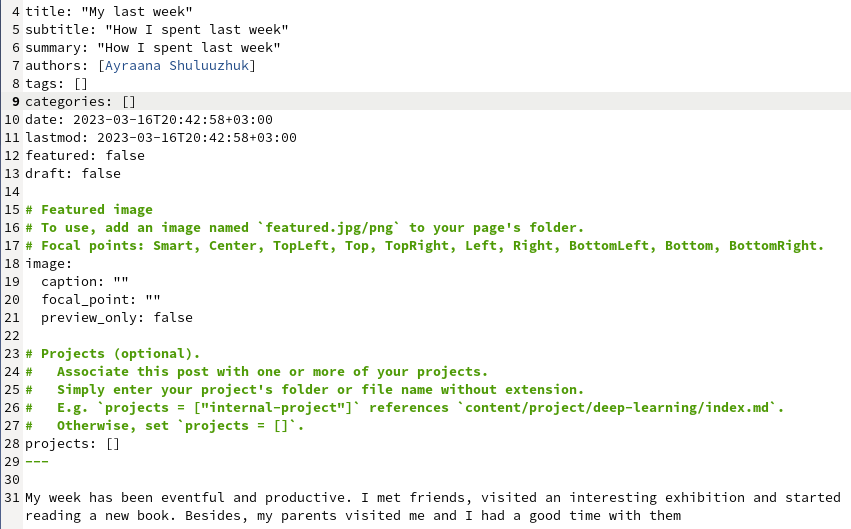

---
## Front matter
title: "Индивидуальный проект. 2 этап"
subtitle: Операционные системы
author: "Шулуужук Айраана Вячеславовна НПИбд-02-22"

## Generic otions
lang: ru-RU
toc-title: "Содержание"

## Bibliography
bibliography: bib/cite.bib
csl: pandoc/csl/gost-r-7-0-5-2008-numeric.csl

## Pdf output format
toc: true # Table of contents
toc-depth: 2
lof: true # List of figures
lot: true # List of tables
fontsize: 12pt
linestretch: 1.5
papersize: a4
documentclass: scrreprt
## I18n polyglossia
polyglossia-lang:
  name: russian
  options:
	- spelling=modern
	- babelshorthands=true
polyglossia-otherlangs:
  name: english
## I18n babel
babel-lang: russian
babel-otherlangs: english
## Fonts
mainfont: PT Serif
romanfont: PT Serif
sansfont: PT Sans
monofont: PT Mono
mainfontoptions: Ligatures=TeX
romanfontoptions: Ligatures=TeX
sansfontoptions: Ligatures=TeX,Scale=MatchLowercase
monofontoptions: Scale=MatchLowercase,Scale=0.9
## Biblatex
biblatex: true
biblio-style: "gost-numeric"
biblatexoptions:
  - parentracker=true
  - backend=biber
  - hyperref=auto
  - language=auto
  - autolang=other*
  - citestyle=gost-numeric
## Pandoc-crossref LaTeX customization
figureTitle: "Рис."
tableTitle: "Таблица"
listingTitle: "Листинг"
lofTitle: "Список иллюстраций"
lotTitle: "Список таблиц"
lolTitle: "Листинги"
## Misc options
indent: true
header-includes:
  - \usepackage{indentfirst}
  - \usepackage{float} # keep figures where there are in the text
  - \floatplacement{figure}{H} # keep figures where there are in the text
---

# Цель работы

Добавить к сайту данные о себе.

# Задание

1. Разместить фотографию владельца сайта.

2. Разместить краткое описание владельца сайта (Biography).

3. Добавить информацию об интересах (Interests).

4. Добавить информацию от образовании (Education).

5. Сделать пост по прошедшей неделе

6. Добавить пост на тему по выбору:

- Управление версиями. Git.

- Непрерывная интеграция и непрерывное развертывание (CI/CD).

# Выполнение индивидуального проекта 

1. В каталоге admin добавляем фотографию (рис. @fig:001)

{#fig:001 width=70%}

2. Добавим информацию о владельце сайта. В каталоге admin открываем файл index.md и внесем информацию: имя, фамилия, образование, интересы (рис. @fig:002)

{#fig:002 width=70%}

3. Cоздаем пост по теме "Git. Version control systems" (рис. @fig:003) (рис. @fig:004)

{#fig:003 width=70%}

{#fig:004 width=70%}

4. Создаем пост по прошедшей неделе  (рис. @fig:005) (рис. @fig:006)

{#fig:005 width=70%}

{#fig:006 width=70%}

5. Отправим файлы на Github. (рис. @fig:007) (рис. @fig:008)

{#fig:007 width=70%}

{#fig:008 width=70%}

6. Переходим на персональный сайт и просмотрим результат проделанных действий (рис. @fig:009)

{#fig:009 width=70%}

Созданные посты (рис. @fig:010)

{#fig:010 width=70%}

# Выводы

В ходе выполнения 2 этапа индивидуального проекта мы добавили информацию о владельце персонального сайта и приобрели практические навыки по созданию новых постов

